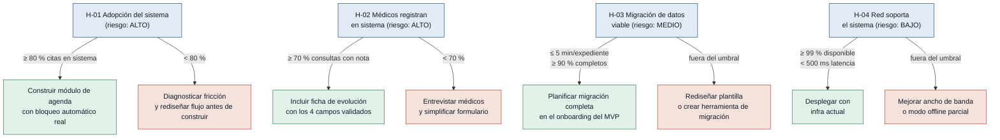

# Hipótesis y Experimentos — citamedicos

> Generado desde `mvp-canvas.md`, `requisitos.md` y `evidence-map.json` de
> `discoveries/citamedicos/outputs/`.
> Fecha: 2026-06-18

Cuatro supuestos riesgosos identificados en el MVP Canvas, ordenados de mayor a
menor riesgo (impacto de equivocarse × incertidumbre actual).

---

## Árbol de decisión por hipótesis

---

### [H-01] Adopción del sistema por parte del personal — riesgo: alto

- **Supuesto a probar:** El personal de la clínica (recepcionistas, médicos y
  facturación) adoptará el sistema y dejará de usar hojas de cálculo y herramientas
  fragmentadas en su flujo de trabajo diario. Sin esto, ninguna métrica del MVP se
  puede cumplir.
- **Hipótesis:** Creemos que el personal de la clínica registrará el 80 % de las
  citas en el sistema unificado si se les ofrece un calendario compartido que bloquea
  conflictos automáticamente, porque la principal fricción actual es detectar
  manualmente la disponibilidad de médicos y consultorios.
- **Señal medible:** Porcentaje de citas agendadas a través del nuevo sistema frente
  al total de citas registradas en la semana.
- **Criterio de éxito:** ≥ 80 % de las citas registradas en el sistema durante la
  segunda semana del piloto (14 días de observación).
- **Experimento:** Concierge / piloto operativo — habilitar el calendario compartido
  con 1 recepcionista y 2 médicos durante 2 semanas; observar resistencia, frecuencia
  de recaída a hojas de cálculo y conteo diario de citas registradas por canal.
- **Caja de tiempo/costo:** 2 semanas; sin costo de infraestructura adicional (usar
  Google Calendar como simulacro del calendario unificado con protocolo manual de
  bloqueo).
- **Regla de decisión:** Si pasa → construir el módulo de agenda con bloqueo
  automático real y planificar onboarding para toda la clínica. Si falla → entrevistar
  al personal para identificar la fricción específica (velocidad, formación
  insuficiente, flujo más lento que el actual) y rediseñar el flujo antes de construir.

---

### [H-02] Médicos registran evolución en el sistema en lugar de papel — riesgo: alto

- **Supuesto a probar:** Los médicos especialistas registrarán sus notas de evolución
  de consulta en el sistema digital. Si no lo hacen, la historia clínica centralizada
  queda vacía y la métrica de carga < 3 s no tiene sentido.
- **Hipótesis:** Creemos que los médicos especialistas registrarán las notas de
  evolución en el sistema si el formulario de evolución tiene 4 campos clave y se
  completa en menos de 2 minutos, porque su principal objeción al registro digital es
  el tiempo adicional que consume durante la consulta.
- **Señal medible:** Porcentaje de consultas realizadas que tienen nota de evolución
  registrada en el sistema al cierre del día.
- **Criterio de éxito:** ≥ 70 % de las consultas del piloto con nota de evolución
  registrada en el sistema al finalizar la segunda semana (14 días de observación con
  3 médicos).
- **Experimento:** Prototipo desechable — formulario de 4 campos (motivo de consulta,
  diagnóstico, tratamiento indicado, próxima cita) construido en Google Forms;
  observación directa con 3 médicos durante 2 semanas; medir tiempo de llenado y
  tasa de completitud diaria.
- **Caja de tiempo/costo:** 2 semanas; diseño del formulario en 3 días sin costo de
  desarrollo.
- **Regla de decisión:** Si pasa → incluir los 4 campos validados como núcleo de la
  ficha de evolución en el MVP. Si falla → entrevistar a los médicos para diagnosticar
  la fricción real (campo incorrecto, velocidad insuficiente, privacidad) y simplificar
  o rediseñar el formulario antes de incluirlo en el MVP.

---

### [H-03] Migración de datos históricos viable sin esfuerzo prohibitivo — riesgo: medio

- **Supuesto a probar:** Los datos históricos de pacientes (antecedentes, alergias,
  medicamentos actuales) pueden migrarse o ingresarse al nuevo sistema sin un esfuerzo
  tan alto que haga inviable el proyecto.
- **Hipótesis:** Creemos que la clínica podrá ingresar los datos de sus pacientes
  activos con un tiempo ≤ 5 minutos por expediente si se provee una plantilla de
  importación estructurada, porque la mayor parte de los datos ya están digitalizados
  en las hojas de cálculo actuales.
- **Señal medible:** Tiempo promedio de ingreso por expediente de paciente y porcentaje
  de expedientes con datos mínimos completos (antecedentes + alergias + medicamentos
  actuales) al finalizar la sesión.
- **Criterio de éxito:** Tiempo promedio de ingreso ≤ 5 minutos por expediente Y ≥ 90 %
  de los 20 expedientes del piloto con datos mínimos completos en una sesión de 4 horas.
- **Experimento:** Piloto de migración manual — seleccionar 20 expedientes reales de
  pacientes activos (con consentimiento), proveer una plantilla CSV y pedir a la
  recepcionista que los ingrese sin asistencia técnica adicional; medir tiempo y tasa
  de completitud.
- **Caja de tiempo/costo:** 1 día de sesión de ingreso; diseño de plantilla en 2 horas;
  sin costo de herramientas adicionales.
- **Regla de decisión:** Si pasa → planificar la migración completa como parte del
  onboarding del MVP con la misma plantilla. Si falla → rediseñar la plantilla de
  importación o evaluar si se necesita una herramienta de migración dedicada antes del
  lanzamiento.

---

### [H-04] La infraestructura de red soporta el sistema en tiempo real — riesgo: bajo

- **Supuesto a probar:** La red existente de la clínica soporta el acceso simultáneo
  de recepcionistas, médicos y facturación a un sistema web en tiempo real sin
  degradación durante el horario de atención.
- **Hipótesis:** Creemos que la red de la clínica soportará el sistema sin
  interrupciones si al menos 10 usuarios simultáneos acceden a la aplicación web con
  latencia < 500 ms, porque la clínica ya usa otras aplicaciones web durante el
  horario de atención sin reportar problemas de conectividad.
- **Señal medible:** Porcentaje de disponibilidad del sistema y latencia promedio de
  respuesta medidos durante el horario de atención (8 horas diarias).
- **Criterio de éxito:** Disponibilidad ≥ 99 % y latencia promedio < 500 ms durante
  5 días consecutivos de prueba en la red de la clínica con 10 usuarios concurrentes
  simulados.
- **Experimento:** Test de carga técnico — desplegar una versión mínima del sistema en
  un servidor de prueba y simular 10 usuarios concurrentes con Apache JMeter durante
  5 días laborables en la red local de la clínica.
- **Caja de tiempo/costo:** 5 días; costo de servidor de prueba ≤ 20 USD.
- **Regla de decisión:** Si pasa → proceder con el despliegue en la infraestructura
  actual de red sin cambios. Si falla → evaluar mejora de ancho de banda o cambio a
  arquitectura más liviana (caché agresivo, modo offline parcial) antes de desplegar
  en producción.
