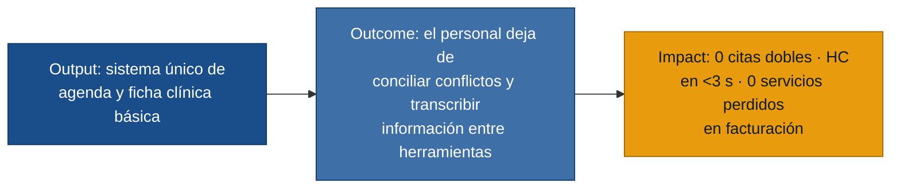

# MVP Canvas — citamedicos

> Generado desde `personas.md`, `requisitos.md` y `user-stories.md` de
> `discoveries/citamedicos/outputs/`.
> Fecha: 2026-06-18

---

## Cadena de valor: output → outcome → impact

---

## MVP Canvas — Sistema de Gestión de Citas y Ficha Clínica

| Bloque | Contenido |
|---|---|
| **Propuesta de valor** | Eliminar los conflictos de agenda y la fragmentación de información que obligan al personal de la clínica a conciliar manualmente entre sistemas distintos cada día. |
| **Segmento de usuarios** | Recepcionista (coordinación de agenda), Médico Especialista (acceso a historial clínico), Responsable de Facturación (registro de servicios). |
| **Funcionalidades mínimas** | 1. Calendario unificado en tiempo real con bloqueo automático de conflictos de horario y consultorio (US-01, US-02). 2. Recordatorios automáticos de cita al paciente 24 h antes (US-03). 3. Ficha clínica básica por paciente: antecedentes, alergias, medicamentos actuales y registro cronológico de evolución de consulta (US-04, US-05). 4. Traspaso automático de servicios al módulo de facturación y generación de factura consolidada por visita (US-06, US-07). |
| **Resultado esperado (outcome)** | La recepcionista no necesita revisar múltiples fuentes para detectar disponibilidad ni llamar pacientes por reagendamientos masivos. El médico accede a la historia clínica en menos de 3 segundos desde cualquier sede. El responsable de facturación no transcribe manualmente los servicios de cada visita. |
| **Métrica de éxito** | 1. Conflictos de horario registrados por semana = **0** al finalizar el primer mes de operación. 2. Tiempo de carga de la ficha clínica **< 3 segundos** en el 90 % de los accesos (log del sistema). 3. Porcentaje de servicios trasladados automáticamente a facturación **≥ 95 %** en las primeras cuatro semanas. |
| **Riesgos / supuestos** | 1. El personal adopta el sistema y abandona las hojas de cálculo (supuesto de cambio de hábito — el más alto). 2. Los datos históricos de pacientes se pueden migrar o ingresar sin un esfuerzo prohibitivo. 3. Los médicos registran sus notas de evolución en el sistema en lugar de papel. 4. La red de la clínica soporta un sistema web en tiempo real sin interrupciones durante el horario de atención. |
| **Fuera de alcance (por ahora)** | **Lista de espera** (R-06): requiere validar el flujo de cancelaciones antes de automatizarlo. **Reagendamiento masivo automatizado** (R-04): en el MVP se resuelve manualmente con la agenda unificada; la notificación automática espera a la segunda iteración. **Integración con aseguradoras** (R-14): cada aseguradora tiene reglas propias; complejidad alta, es la segunda iteración. **Prescripción electrónica** (R-11): requiere integración con sistemas regulatorios. **Carga de imágenes diagnósticas** (R-10): infraestructura de almacenamiento adicional no disponible aún. **Reportes financieros automáticos** (R-16): fuera hasta consolidar datos reales de facturación. **Portal del paciente**: ninguna entrevista de primera mano del paciente; no se pueden comprometer funcionalidades para este rol. |

---

## Prueba ácida de las métricas

Cada métrica pasa la prueba ácida si, cuando sube, alguien del negocio puede
decir qué decisión cambia:

- **Conflictos de horario = 0** → la dirección puede decidir eliminar los procesos
  manuales de verificación de agenda y las llamadas de corrección de citas dobles.
- **Carga de HC < 3 s en 90 % de accesos** → el médico puede decidir prescindir del
  expediente físico durante la consulta.
- **Traspaso automático ≥ 95 %** → facturación puede decidir eliminar el proceso de
  transcripción manual de servicios por visita.
