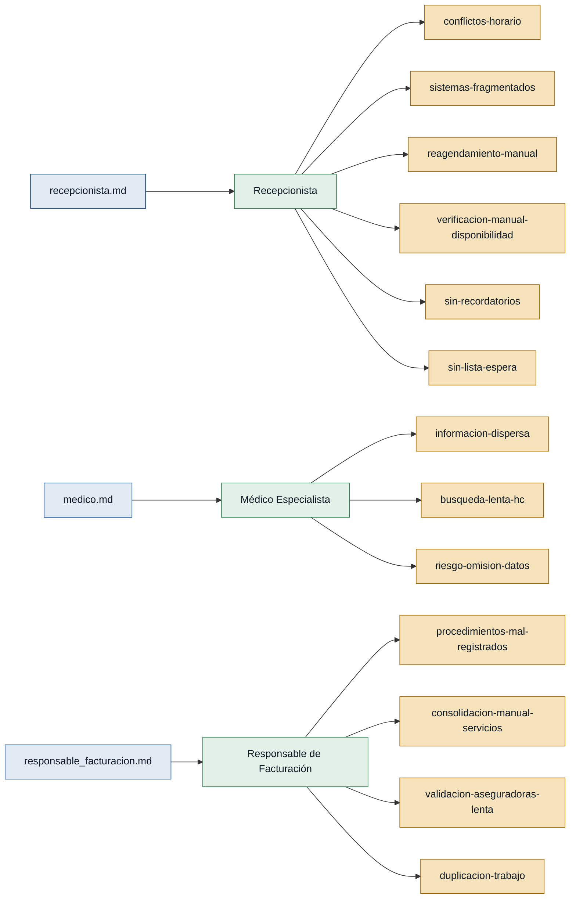

# Personas y Stakeholders — citamedicos

> Artefacto generado desde las entrevistas de `discoveries/citamedicos/interviews/`.
> Fecha: 2026-06-18

---

## Mapa de trazabilidad

> Verde = persona con respaldo de primera mano · Ámbar = dolor · Azul claro = entrevista fuente

---

## Personas

### Recepcionista — recepcionista
- **Contexto:** Encargada del registro de pacientes y la gestión de citas en la clínica.
- **Objetivo principal:** Coordinar médicos, pacientes y consultorios de forma ágil y sin errores.
- **Dolores:**
  - Conflictos de horarios: se agendaban dos pacientes a la misma hora o un consultorio ya reservado. (`conflictos-horario`) (recepcionista.md)
  - Sistemas fragmentados: coexisten agenda electrónica y hojas de cálculo según especialidad. (`sistemas-fragmentados`) (recepcionista.md)
  - Reagendamiento manual masivo: cuando un médico modifica su horario hay que llamar uno a uno a todos los pacientes afectados. (`reagendamiento-manual`) (recepcionista.md)
  - Verificación manual de disponibilidad: con varios médicos o sedes se vuelve costoso revisar la agenda. (`verificacion-manual-disponibilidad`) (recepcionista.md)
  - Sin recordatorios automáticos: los recordatorios de citas deben gestionarse manualmente. (`sin-recordatorios`) (recepcionista.md)
  - Sin lista de espera: no existe mecanismo para llenar huecos generados por cancelaciones. (`sin-lista-espera`) (recepcionista.md)
- **Respaldo:** `primera mano` (recepcionista.md)

---

### Médico Especialista — medico_especialista
- **Contexto:** Profesional de salud que atiende consultas y necesita acceder a la historia clínica del paciente antes y durante cada atención.
- **Objetivo principal:** Acceder de inmediato a toda la información clínica relevante del paciente para ofrecer una atención segura y oportuna.
- **Dolores:**
  - Información clínica dispersa en varios sistemas y documentos físicos; no hay una única fuente de verdad. (`informacion-dispersa`) (medico.md)
  - Tiempo perdido buscando datos que deberían estar disponibles de inmediato. (`busqueda-lenta-hc`) (medico.md)
  - Riesgo de pasar por alto datos importantes (alergias, medicamentos) por la fragmentación. (`riesgo-omision-datos`) (medico.md)
- **Respaldo:** `primera mano` (medico.md)

---

### Responsable de Facturación — responsable_facturacion
- **Contexto:** Persona a cargo de emitir facturas, registrar pagos, controlar cuentas pendientes y preparar reportes financieros.
- **Objetivo principal:** Facturar correctamente y a tiempo los servicios prestados, minimizando errores de registro y retrasos.
- **Dolores:**
  - Procedimientos no llegan correctamente registrados desde recepción; información incompleta para cobrar. (`procedimientos-mal-registrados`) (responsable_facturacion.md)
  - Consolidación manual de todos los servicios cuando el paciente recibe varias atenciones en la misma visita. (`consolidacion-manual-servicios`) (responsable_facturacion.md)
  - Validación de coberturas y preparación de documentos para aseguradoras consume mucho tiempo (cada aseguradora tiene sus propias reglas). (`validacion-aseguradoras-lenta`) (responsable_facturacion.md)
  - Duplicación de trabajo entre áreas que provoca errores de registro y retrasos en la facturación. (`duplicacion-trabajo`) (responsable_facturacion.md)
- **Respaldo:** `primera mano` (responsable_facturacion.md)

---

## Stakeholders

### Administración / Dirección de la clínica
- **Interés en el sistema:** Recibe reportes financieros y necesita información consolidada para la toma de decisiones gerenciales.
- **Fuente:** responsable_facturacion.md (mencionada como destinataria de informes financieros)

### Aseguradoras
- **Interés en el sistema:** Requieren documentación y validación de coberturas para autorizar y pagar prestaciones médicas según sus propias reglas.
- **Fuente:** responsable_facturacion.md

### Paciente
- **Interés en el sistema:** Recibe las citas, los recordatorios y eventualmente las facturas; su experiencia depende de la coordinación entre recepcionista, médico y facturación.
- **Fuente:** mencionado implícitamente en recepcionista.md, medico.md y responsable_facturacion.md
- **Nota:** No existe entrevista de primera mano. Si el MVP involucra flujos desde la perspectiva del paciente, **se requiere una entrevista directa** antes de comprometer funcionalidades para este rol.
