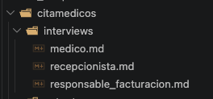
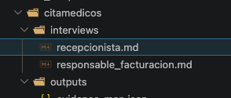
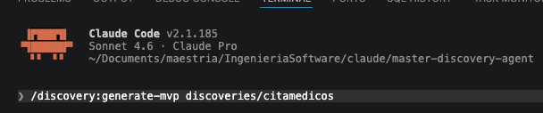
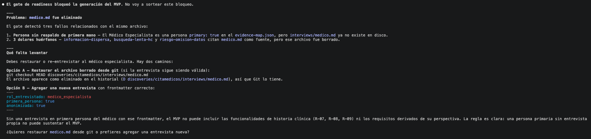
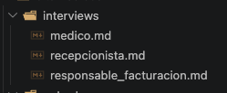
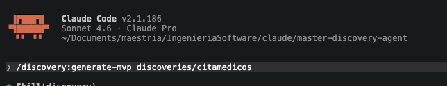
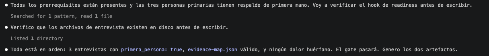
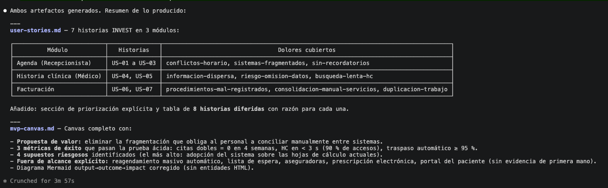

# Gate prueba de bloqueo 

## Prueba de bloqueo

El proyecto de cita medicos tiene 3 entrevistas. Para realizar la prueba se va a proceder a eliminar el archivo de la entrevista del médico, el cual es una persona principal del sistema. El hook readiness-gate debería bloquear la ejecución del comando.

 

Ahora se procede a correr el comando generate-mvp.

El archivo readiness-gate detecta que el archivo de entrevista de medico.md no existe y no permite continuar con el siguiente paso para generar el MVP. Además, el modelo llega a detectar que el archivo fue eliminado en el historial de git.

## Prueba luego de restaurar el archivo

 Se procede a correr nuevamente el comando generate-mvp

 

 Esta vez el gate verifica que los archivos necesarios para generar el mvp existen.

 

 Finalmente los artefactos son generados con éxito.

 